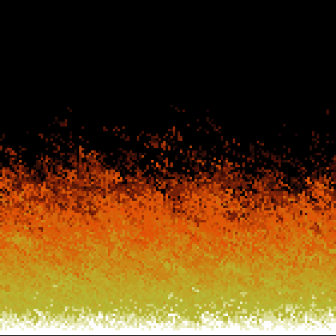
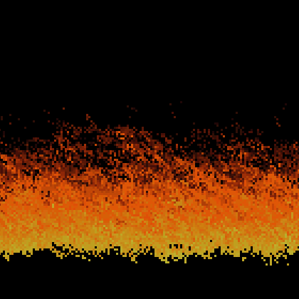
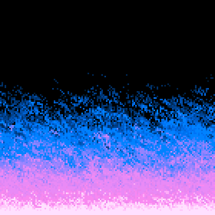

# Interactive Doom fire effect

An interactive Doom fire effect with realtime adjustment using the open source game library [ebiten](https://ebiten.org/).
You can read [Fabien Sanglard - doom_fire_psx](https://fabiensanglard.net/doom_fire_psx/) blog post for a good description of the effect.

## Usage

Show usage :

```sh
go run cmd/fire/main.go --help
```

## Build & serve

Makefile is your friend.

### Build

Create binaries :

```sh
make linux
make wasm
make windows
```

### Serve

Http server (8080) for `wasm` demo.

```sh
make serve
```

## Keyboard shortcuts

You can change some parameters of the fire effect like : color palette, wind, power...

```sh
[space] Toggle effect
[p] Switch between color palette
[left arrow] Decrease wind
[right arrow] Increase wind
[D] Wind direction
[Pg Up] Increase background opacity
[Pg Down] Decrease background opacity
[Up] Increase fire effect
[Down] Decrease fire effect
```

## Screenshots



